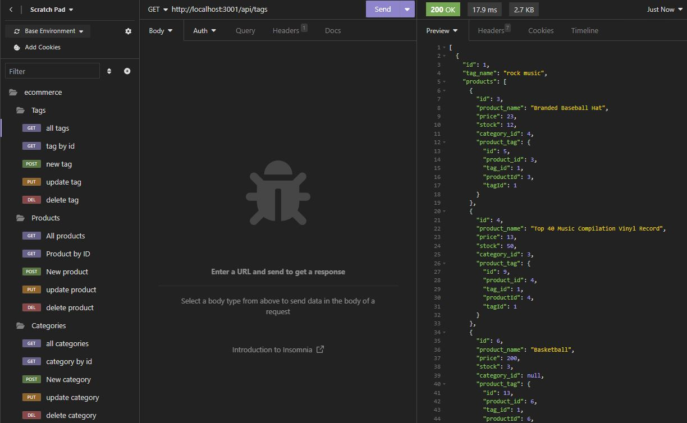

# eCommerce-backend

## Description

Building out a backend for an ecommerce site. My part of the project was to build out the models and routes as well as model associations.

source code: https://github.com/coding-boot-camp/fantastic-umbrella

## Links

Github Repo: https://github.com/aalyman42/eCommerce-backend

Tutorial video: https://drive.google.com/file/d/1g-_H1WFMv6ZQ8HNvxQIQTUSpsisMbEJf/view?usp=sharing

## Screenshot

## Tutorial

1. Clone Repo
2. install requirements with npm i
3. create a .env file with DB credentials through dotenv for sequelize
4. seed data
5. start server and run insomnia tests on api routes
